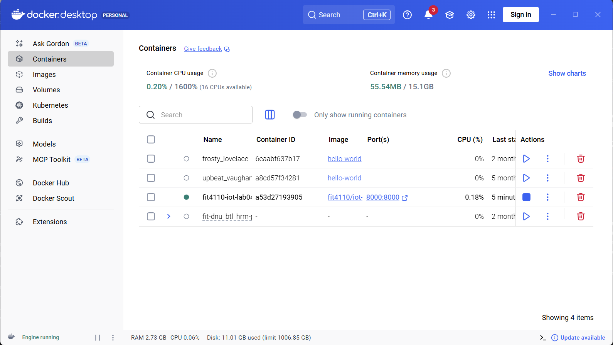
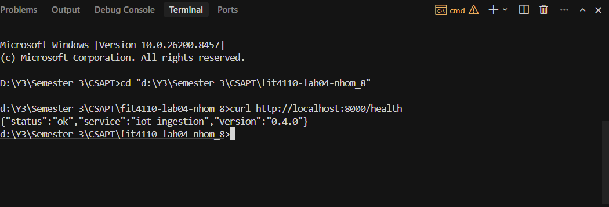
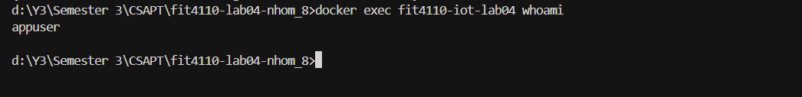
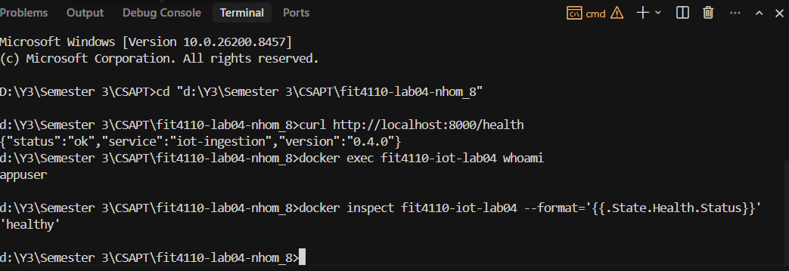
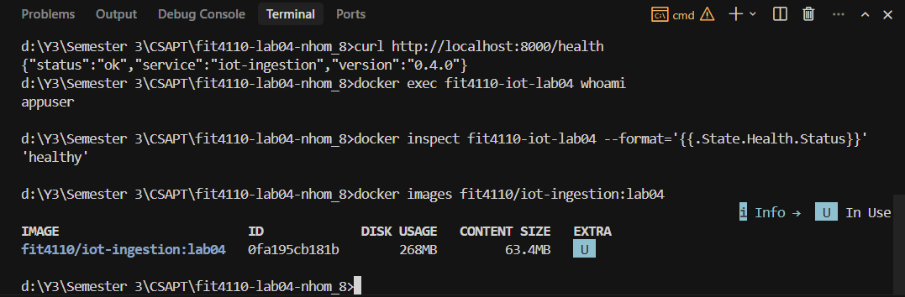
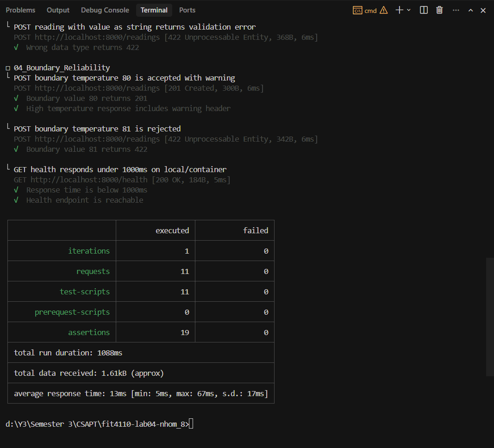
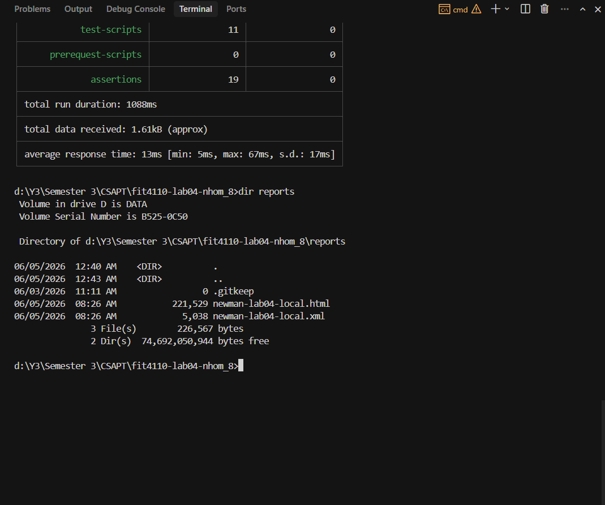

# Lab 04 – Evidence (Bằng chứng hoàn thành)

Ảnh chụp màn hình các lệnh chạy và kết quả để nộp bài.

---

## 1. Container đang chạy

---

## 2. `GET /health` trả 200

---

## 3. Service chạy bằng non-root user (`appuser`)

---

## 4. Newman test PASS trên container

---

## 5. Report files sinh ra trong `reports/`

---

## 6. Image tag đúng quy ước

---

## 7. Image đã push lên GitHub Container Registry (GHCR)

---

## Checklist đã hoàn thành

| # | Yêu cầu | Evidence |
|---|---|---|
| 1 | `Dockerfile` build được image | Ảnh 1 + Ảnh 6 |
| 2 | Image chạy được container | Ảnh 1 |
| 3 | `GET /health` trả `200` | Ảnh 2 |
| 4 | Service chạy non-root user | Ảnh 3 |
| 5 | Có `.dockerignore` | Có trong repo |
| 6 | Có `.env.example` | Có trong repo |
| 7 | Có `RUN_LOCAL.md` | Có trong repo |
| 8 | Newman test PASS trên container | Ảnh 4 |
| 9 | Test functional/auth/negative/boundary | Trong Postman collection |
| 10 | Error trả đúng `ProblemDetails` | Trong Newman report |
| 11 | Có report trong `reports/` | Ảnh 5 |
| 12 | Image tag đúng quy ước | Ảnh 6 |
| 13 | Push lên registry | Ảnh 7 |
